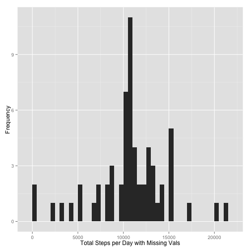

## Loading and Pre-Processing Data
Here we download the dataset from its respective repository, decompress the file and put it into a usable format.


```r
library(Hmisc)
library(reshape2)
library(ggplot2)

filename = "project_dataset.zip"

# Download the dataset
fileURL <- "https://d396qusza40orc.cloudfront.net/repdata%2Fdata%2Factivity.zip"
download.file(fileURL, filename, method="curl")

# Unzip the dataset
unzip(filename)

# Load activity labels
activityLabels <- read.csv("activity.csv")
```

## Mean Total Number of Steps Taken per Day

This part of the assignment calculates and plots the mean and total number of steps taken per day. Missing values in the dataset are ignored.

### Total Number of Steps Taken per Day

First, we calculate the total number of steps taken per day


```r
stepsPerDay <- tapply(activityLabels$steps, activityLabels$date, sum, na.rm=TRUE)
```

Histogram of the total number of steps taken per day


```r
qplot(stepsPerDay, xlab='Total Number of Steps per Day', ylab='Frequency', binwidth=500)
```

 

### Mean and Median Steps Taken per Day

Lastly, we calculate the mean and median aggregate features of steps taken per day.


```r
stepsPerDayMean <- mean(stepsPerDay)
stepsPerDayMedian <- median(stepsPerDay)
```

```r
stepsPerDayMean
```

[1] 9354.23

```r
stepsPerDayMedian
```

[1] 10395

## Average Daily Activity Pattern


```r
avgStepsPerWin <- aggregate(x=list(meanSteps=activityLabels$steps), by=list(interval=activityLabels$interval), FUN=mean, na.rm=TRUE)
```

Time series plot of average steps taken per day.


```r
ggplot(data=avgStepsPerWin, aes(x=interval, y=meanSteps)) +
    geom_line() +
    xlab("Five Minute Interval") +
    ylab("Average Steps Taken") 
```

 


```r
maxSteps <- which.max(avgStepsPerWin$meanSteps)
tMaxSteps <-  gsub("([0-9]{1,2})([0-9]{2})", "\\1:\\2", avgStepsPerWin[maxSteps,'interval'])
```


```r
maxSteps
```

[1] 104

## Inputting Missing Values

Find the number of missing values in the dataset, represented by "NA"


```r
numMissingValues <- length(which(is.na(activityLabels$steps)))
```


```r
numMissingValues
```

[1] 2304

### New Dataset with Missing Values

A new dataset is created with the missing values filled using the impute function based on the mean.


```r
activityLabelsWithMsngVls <- activityLabels
activityLabelsWithMsngVls$steps <- impute(activityLabels$steps, fun=mean)
```


```r
stepsPerDayMsngVals <- tapply(activityLabelsWithMsngVls$steps, activityLabelsWithMsngVls$date, sum)
qplot(stepsPerDayMsngVals, xlab='Total Steps per Day with Missing Vals', ylab='Frequency', binwidth=500)
```

 

### Mean and Median Total Number of Steps per Day

Calculate the mean and median aggregate features on the new dataset with the missing values filled.

```r
stepsPerDayAvgMsngVals <- mean(stepsPerDayMsngVals)
stepsPerDayMedMsngVals <- median(stepsPerDayMsngVals)
```


```r
stepsPerDayAvgMsngVals
```

[1] 10766.19

```r
stepsPerDayMedMsngVals
```

[1] 10766.19

## Differences in Activity Patterns for Weekends vs Weekdays

### Determine if Weekend or Weekday

New column inserted to denote if the given observation was on a weekday or a weekend.


```r
activityLabelsWithMsngVls$dateType <-  ifelse(as.POSIXlt(activityLabelsWithMsngVls$date)$wday %in% c(0,6), 'weekend', 'weekday')
```

### Panel Plot

Panel plot containing a time series plot of the 5-minute interval (x-axis) and the average number of steps taken, averaged across all weekday days or weekend days (y-axis).


```r
activityLabelsWithMsngVls <- aggregate(steps ~ interval + dateType, data=activityLabelsWithMsngVls, mean)
ggplot(activityLabelsWithMsngVls, aes(interval, steps)) + 
    geom_line() + 
    facet_grid(dateType ~ .) +
    xlab("Five Minute Interval") + 
    ylab("Average Number of Steps Taken")
```

 
